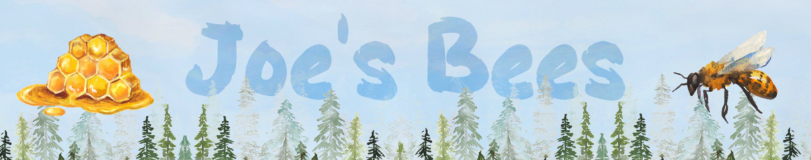

# Bees

Remember during the pandemic when everyone starting taking up new hobbies? Some people baked bread or sewed masks or played Animal Crossing. I didn't do any of that. I became beekeeper! 

Whenever I tell someone I started a beehive they excidedly start asking questions and want to see photos. What does the hive look like? Do they make Honey? Did you get stung?! 

I decided to make a small website for to share all this information and more! Currently, I'm working on a livestream camera so people can check-in to see how the bees are doing. Something like "lofi-beats for bees". I also have plans for a hive-scale where the whole hive is placed on a scale to track its weight as the bees fill it up with honey. 

If you want to see for youself visit https://samela.io/bees
